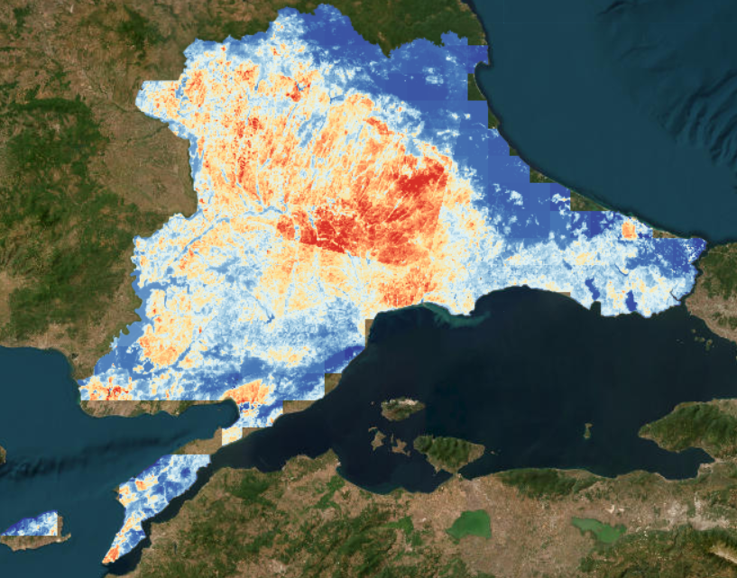

# sebal-et-gee

A modular Python implementation of the SEBAL (Surface Energy Balance Algorithm for Land)
evapotranspiration model on Google Earth Engine, applied to the Turkish Thrace region.

The pipeline ingests Landsat 8/9 Collection 2 Level 2 imagery and ERA5-Land reanalysis,
computes a full surface energy balance (Rn, G, H, λET), and produces daily
evapotranspiration (mm/day) at 30 m resolution.

**Use case:** operational agricultural drought monitoring over Thrace (Edirne, Kırklareli,
Lüleburgaz, Uzunköprü, İpsala, Çorlu, Tekirdağ, Sarıyer).



## Features

- **Landsat 8+9 harmonized mosaic** with automatic cloud masking (QA_PIXEL) and Collection 2
  Level 2 scale factors
- **Best-window search** that automatically selects the anchor date with maximum AOI coverage
- **Tasumi (2008) broadband albedo** from OLI surface reflectance
- **Net radiation** from ERA5-Land shortwave/longwave + Stefan-Boltzmann outgoing
  longwave with NDVI-based emissivity
- **Bastiaanssen (1998) soil heat flux G** with water-body override
- **CIMEC (Calibration using Inverse Modeling of Extreme Conditions) iterative H**
  with Monin-Obukhov stability correction — the canonical SEBAL inversion
- **Daily ET via Evaporative Fraction** using ERA5-Land 24-hour net radiation
- **GeoTIFF export** to Google Drive for downstream GIS use

## Repository layout

```
sebal-et-gee/
├── sebal/                   # Python package (9 modules)
│   ├── config.py            # physical constants + default parameters
│   ├── landsat.py           # L8+L9 mosaic + best-anchor search
│   ├── era5.py              # ERA5-Land meteorology + 24h Rn
│   ├── albedo.py            # Tasumi 2008 broadband albedo
│   ├── radiation.py         # net radiation + air density
│   ├── soil_heat.py         # Bastiaanssen 1998 G
│   ├── sensible_heat.py     # anchor selection + CIMEC H iteration
│   ├── et_daily.py          # latent heat + EF + daily ET
│   └── utils.py             # EE init, AOI loaders, station extraction
├── notebooks/               # step-by-step development notebooks (Days 1–4)
├── data/                    # Thrace AOI + station coordinates
│   └── outputs/             # exported GeoTIFFs (gitignored)
└── docs/                    # figures and plots
```

## Installation

### Prerequisites

- Google Earth Engine account with a Cloud Project
  (sign up at [earthengine.google.com](https://earthengine.google.com))
- Python 3.10+

### Setup

```bash
git clone https://github.com/<your-username>/sebal-et-gee.git
cd sebal-et-gee

# Option 1: pip
pip install -r requirements.txt

# Option 2: conda
conda env create -f environment.yml
conda activate sebal-et-gee
```

### Earth Engine authentication

```python
import ee
ee.Authenticate()   # browser flow
ee.Initialize(project='your-ee-project-id')
```

## Quick start

```python
import ee
from sebal import (
    build_landsat_mosaic, load_era5_meteorology,
    compute_albedo_tasumi, compute_net_radiation,
    compute_soil_heat_flux, select_anchor_pixels,
    solve_sensible_heat_cimec, compute_daily_et,
)
from sebal.albedo import compute_ndvi, compute_emissivity
from sebal.radiation import compute_air_density
from sebal.sensible_heat import compute_roughness, compute_neutral_aerodynamics
from sebal.era5 import load_era5_daily_rn
from sebal.utils import init_ee, load_aoi

init_ee('your-ee-project-id')

# 1. AOI
_, _, aoi_geom = load_aoi('data/thrace_boundary.geojson')

# 2. Landsat mosaic
mosaic, _, coverage = build_landsat_mosaic(
    aoi_geom, anchor_date='2023-07-20', window_days=14
)
print(f'AOI coverage: {coverage:.1f}%')

# 3. ERA5-Land
start = ee.Date('2023-07-13')
end = ee.Date('2023-07-27')
era5 = load_era5_meteorology(aoi_geom, start, end)
rn_24h = load_era5_daily_rn(aoi_geom, start, end)

# 4. Albedo + NDVI + emissivity + LST
albedo = compute_albedo_tasumi(mosaic)
ndvi = compute_ndvi(mosaic)
emissivity = compute_emissivity(ndvi)
lst_k = mosaic.select('LST_K')

# 5. Energy balance components
rn = compute_net_radiation(
    albedo, era5.select('Rs_in'), era5.select('Rl_in'), lst_k, emissivity
)
G, _ = compute_soil_heat_flux(rn, lst_k, albedo, ndvi)
rn_minus_g = rn.subtract(G)

# 6. Anchor pixels
cold_stats, hot_stats, cold_mask, hot_mask = select_anchor_pixels(
    ndvi, lst_k, albedo, rn, G, aoi_geom
)

# 7. Aerodynamics + CIMEC H
z0m = compute_roughness(ndvi)
u_star, u_200, r_ah_init = compute_neutral_aerodynamics(era5.select('wind_10m'), z0m)
rho_air = compute_air_density(era5.select('P_surf'), era5.select('T_air_K'))

H, r_ah, fit = solve_sensible_heat_cimec(
    lst_k, rho_air, u_star, u_200, z0m, r_ah_init,
    rn_minus_g, cold_mask, hot_mask, cold_stats, hot_stats, aoi_geom
)

# 8. Daily ET
LE = rn_minus_g.subtract(H).max(ee.Image(0))
et_daily, ef = compute_daily_et(LE, rn_minus_g, rn_24h, era5.select('T_air_K'))
```

For an end-to-end walkthrough with visualization, see
`notebooks/pipeline_example.ipynb`.

## Validation (Thrace, 2023-07-20 ± 7 days)

Station-level daily ET values aligned with regional hydrology:

| Station     | ET (mm/day) | Land cover context         |
|-------------|-------------|----------------------------|
| Sarıyer     | 5.6         | Bosphorus coastal / forest |
| İpsala      | 4.4         | Meriç delta, irrigated rice |
| Kırklareli  | 3.9         | Mixed forest / cropland   |
| Tekirdağ    | 2.9         | Coastal urban / cropland   |
| Lüleburgaz  | 2.7         | Rainfed cropland, post-harvest |
| Uzunköprü   | 2.6         | Meriç valley, late summer |
| Çorlu       | 2.4         | Urbanized / industrial     |
| Edirne      | 1.4         | Post-harvest stubble       |

The spatial pattern reproduces expected contrasts: irrigated delta > mixed forest >
rainfed cropland > urban > post-harvest stubble.

## Methodological notes

- **Anchor selection** uses the Allen et al. (2013) "CIMEC" percentile approach
  over an agricultural mask (NDVI > 0.05, 0.10 < albedo < 0.30).
- **Stability correction** applies Monin-Obukhov $\psi_m$ and $\psi_h$ under
  unstable conditions (L < 0), which dominates Mediterranean daytime overpass.
- **Daily scaling** assumes constant EF through daytime — a standard SEBAL
  simplification valid for cloud-free days.
- **Not implemented in this MVP:** advective correction, 24-hour EF correction
  with daytime fraction, long-term temporal compositing, ML ET forecasting.

## References

- Allen, R. G. et al. (2013). Automated calibration of the METRIC-Landsat
  evapotranspiration process. *J. AWRA*, 49(3), 563-576.
- Bastiaanssen, W. G. M. (1998). Remote sensing in water resources management:
  The state of the art. *J. Hydrol.*, 212-213, 198-212.
- Tasumi, M., Allen, R. G., & Trezza, R. (2008). At-surface reflectance and
  albedo from satellite for operational calculation of land surface energy
  balance. *J. Hydrol. Eng.*, 13(2), 51-63.

## Author

**Cantekin Kivrak** — Head of the Agrometeorology and Climate Change Department,
Atatürk Soil, Water and Agricultural Meteorology Research Institute (TAGEM),
Kırklareli, Turkey.

## License

MIT — see [LICENSE](LICENSE).
